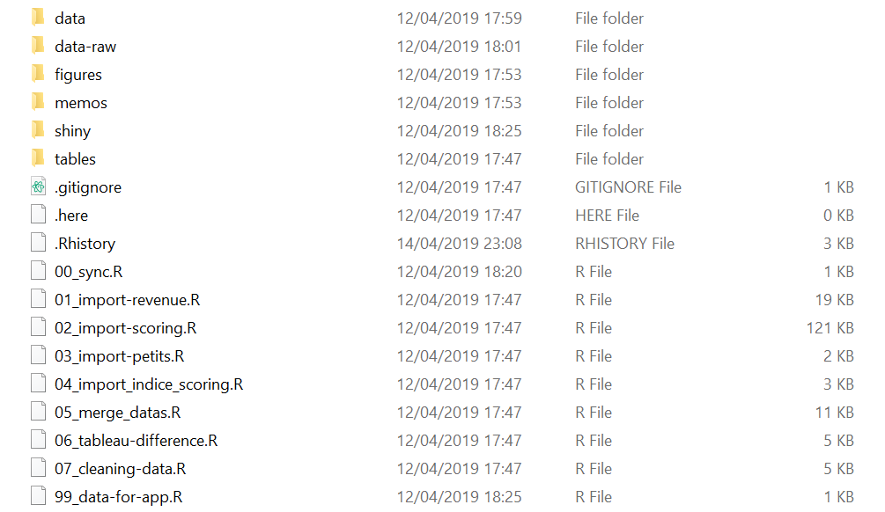
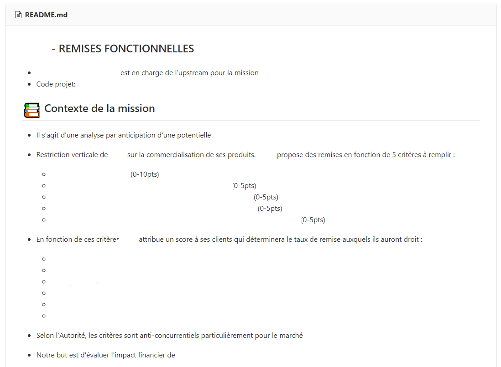
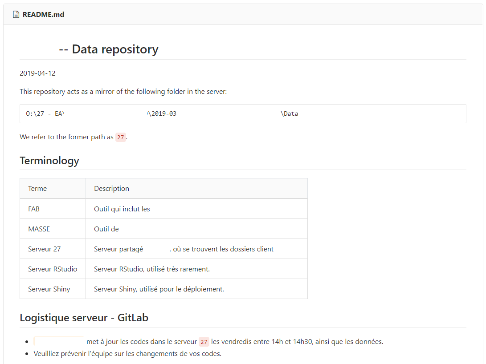
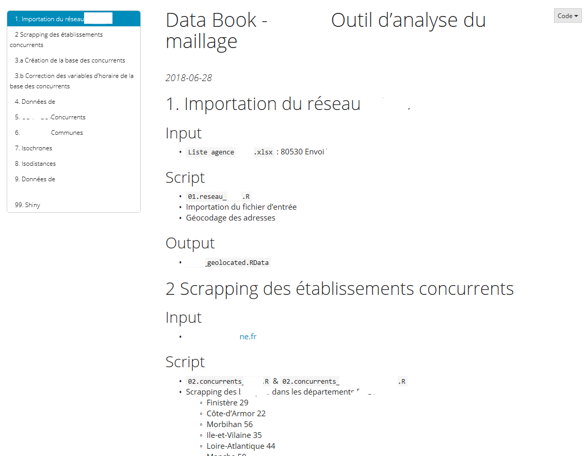
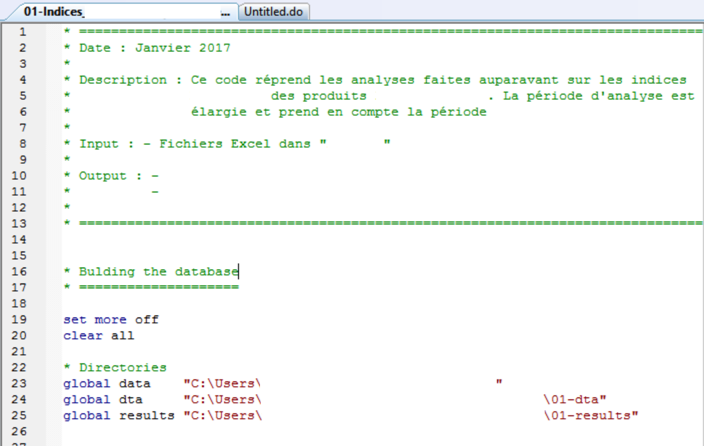
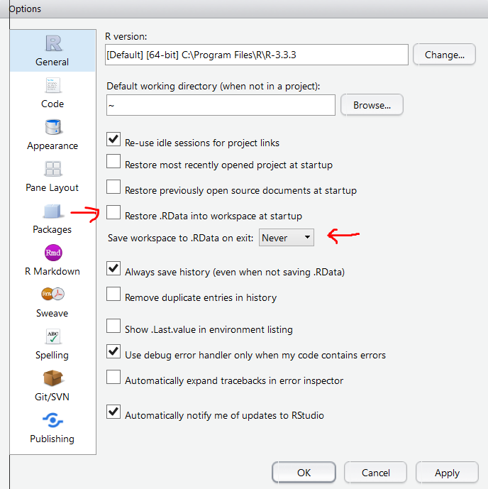
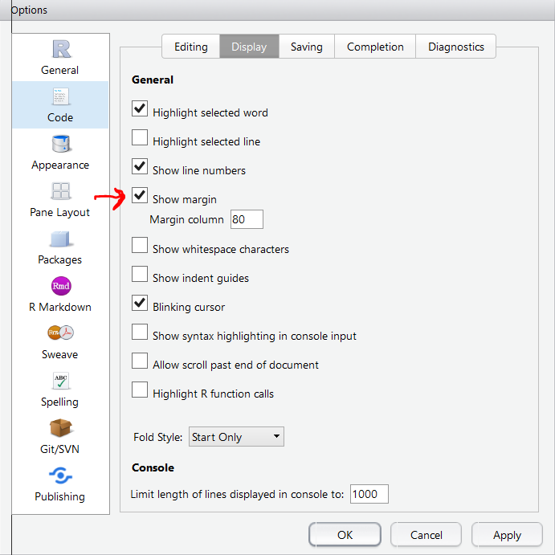
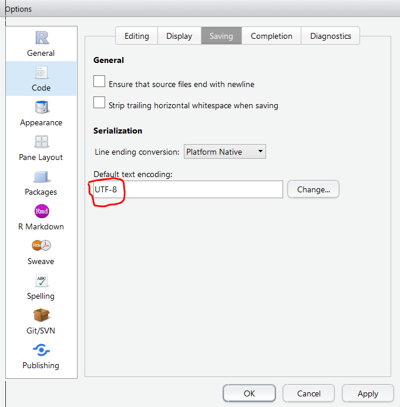
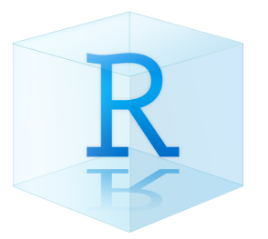
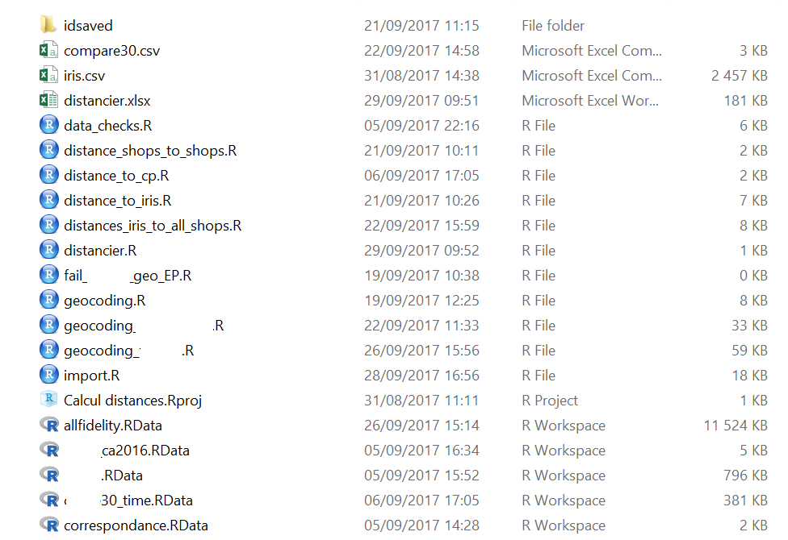

```{r setup, include=FALSE}
options(htmltools.dir.version = FALSE)
knitr::opts_chunk$set(echo = FALSE, fig.align = "center")
```

```{r xaringan-themer, include=FALSE}
library(xaringanthemer)
solarized_light(header_h3_font_size = "45px")
```

```{css}
.my-larger-font {
  font-size: 25px;
}

.small { font-size: 97% }
.large { font-size: 110% }
```


```{r}
library(emo)
library(icon)
```


---
### What is the goal of this presentation?

--

- Give you some guidelines that will your analysis __easier to understand__ and __easier to reproduce__ by others:

--

    - Colleagues
    - Opposing parties
    - Yourself in the future

--

- This guidelines also aim at providing __consistency__, which reduces the __cognitive overload__ in each stage of the analysis.

--

    - Where is the raw data? 
    - Where did I put the code to produce Figure 7?
    - Was this analysis based on the latest data?

--

- Implementing these rules comes at a __cost__, therefore we hope to implement __"good-enough"__ practices, that allow us to ensure the quality of our work without unessesary hassle costs.


---

class: inverse, center, middle

# Good-enough practices
That you should __always__ try to follow

(_regardless_ of your programming language)

---

class: my-larger-font

## Rules of thumb...

--

1. `r ji("dancing_men")` Ensure reproducibility

--

2. `r ji("woman_cartwheeling")` Respect the workflow

--

3. `r ji("floppy_disk")` Respect our naming conventions

--

4. `r ji("memo")` Document your code and analysis

--

5. `r ji("man_dancing")` Adopt a coding style

---

### `r ji("dancing_men")` Reproducibility

--

`r ji("x")` Change the names of the files shared with us by clients or lawyers.

--

`r ji("x")` Modify files *without* a script.

--

`r ji("x")` Change the folder structure inside a contract's main directory without checking with others working in the same case.

--

`r ji("x")` Forget to update your scripts if you have changed the name of files, or of the paths leading to those files.

<!-- TODO: Add screenshots for each one of these. -->
<!-- TODO: Add more gotchas. Link to tweet. -->

---

### `r ji("dancing_men")` Reproducibility

--

`r ji("heavy_check_mark")` Make sure the scripts, inputs and outputs of your analysis are on the server.

--

`r ji("heavy_check_mark")` State at the beginning of your scripts the file paths to your inputs and outputs.

--

`r ji("heavy_check_mark")` Use R and Stata's different tools ensure your outputs are coherent with your code:

- R's [RMarkdown](https://rmarkdown.rstudio.com/).
- Stata's [`esttab/estout`](http://repec.sowi.unibe.ch/stata/estout/).

---

### `r ji("woman_cartwheeling")` Workflow

--
#### .large[`r ji("confused")` What is it?]
--

It refers to the ***way*** in which you work on data analysis projects, either by yourself or with others.

For example:

--

- The *way* you organise your folders.

--

- The *way* you name your scripts.

--

- The *way* you share your changes or updates with others.

--

- The *way* you handle repetitive tasks.

---

### `r ji("woman_cartwheeling")` Workflow

--

#### .large[`r ji("raised_eyebrow")` Why should you care?]

--

- It helps you ensure **reproducibility**.

--

- It makes it easier to **spot and fix** mistakes.

--

- It makes you more **efficient**.

--

#### .large[`r ji("sweat_smile")` ...but is it going to be hard to learn?]

--

- You probably already have your *own* workflow, which you have developed from your own experiences.

--

- Here we are suggesting a **common** workflow that we have developed from our joint experience working on cases.

--

- We have **written it down**, so you can take advantage its benefits know instead of having to learn these lessons the hard way.

---

### `r ji("woman_cartwheeling")` Workflow

--

#### .large[`r ji("floppy_disk")` Organisation]

--

`r ji("page_facing_up")` Scripts should be left in the top-level project directory. All other inputs and outputs should be sorted into 5 sub-directories:

--

- `r ji("file_folder")` **data-raw** -- Raw data sent by lawyers or clients.

--

- `r ji("file_folder")` **data** -- Data files produced from the scripts in the top-level directory. Preferred formats are `.RDS` and `.dta`

--

- `r ji("file_folder")` **figures** -- Figures produced from the scripts. Preferred format is `.png`.

--

- `r ji("file_folder")` **tables** -- Summary tables or excerpts of the data produced for intermediary exchanges with third parties. Generally in `.xlsx` format.

--

- `r ji("file_folder")` **memos** -- Data reports in `.Rmd`, `.docx`, `.pdf` or `.html` format. These are often the dynamic outputs of RMarkdown documents.

--

- `r ji("file_folder")` **shiny** -- Code for one or more Shiny apps.


---

### `r ji("woman_cartwheeling")` Workflow

```{r, out.width="700px"}

```

---

### `r ji("woman_cartwheeling")` Workflow

We are beginning to use **Git**, a version control system, and **GitLab**, a Git-repository manager, for our data analysis projects. Before your first project with Git, make sure you read:

1. [Our documentation on GitLab](i/am/a/fake/path)
2. [The slides of our internal trainings](i/am/a/fake/path)
3. [happygitwithr.com](https://happygitwithr.com/) `r ji("star")` * Highly recommended, even for non-R users*

```{r, out.width="60%"}
knitr::include_graphics("https://happygitwithr.com/img/watch-me-diff-watch-me-rebase-smaller.png")
```

---

### `r ji("floppy_disk")` Good names


[Three principles for file names](https://speakerdeck.com/jennybc/how-to-name-files) of [@JennyBryan](https://twitter.com/JennyBryan) state that file names should:

1. Be machine readable
2. Be human readable
3. Play well will default ordering

<br/>
<br/>

.pull-left[

.center[`r ji("x")` __Bad__]

```
code.do
Importation données avec accents.R
figure avec spaces.png
fig 2.png
Nouve@u-jeu-données!!!.txt
```

]

.pull-right[

.center[`r ji("heavy_check_mark")` __Good__]

```
analyse-prix.do
import-donnees-enseignes.R
fig01_histogram-prix-cadenciers.png
fig02_scatter-comparaison-prix.png
20170304_update-tarifs-de-gros.txt
```

]

---

### `r ji("floppy_disk")` Good names
#### .large[`r ji("point_up")` 1. Machine readable]

- Work well with [**regular expressions**](https://en.wikipedia.org/wiki/Regular_expression).

- Should not contain accents, special characters or spaces.

- Should preferably be in the same case.

<br>

.center[
```
CLIENT_FR_FVO_2015-09-29_17-41-42.txt
CLIENT_FR_FVO_2015-09-29_17-41-54.txt
CLIENT_FR_FVO_2015-09-30_14-05-57.txt
CLIENT_FR_FVO_2015-11-05_10-28-55.txt
CLIENT_FR_FVO_2015-11-06_10-28-55.txt
CLIENT_FR_FVO_2015-11-09_16-10-04.txt
```
]
---

### `r ji("floppy_disk")` Good names
#### .large[`r ji("metal")` 2. Human readable]

- They should be __informative__.

<br>

.center[
```
01_geocodage-pdv-cible.R
02_preparation-couples.R
03_requests-pour-arcgis.R 
04_impute-missing-dist.pdf
04_impute-missing-dist.Rmd
05_clean-distancier-traj.R
99_data-for-app.R
```
]
---

### `r ji("floppy_disk")` Good names
#### .large[ `r ji("love_you")` 3. Play well with default ordering]

- Scripts should be numbered if they need to be run in a given order.

- Think about left-padding the numbers with `0`.

- Dates should be in the format `YYYY-MM-DD` (international standard) or in the format `YYMMDD`, which is the style we have adopted in our reports.

<br>

.center[
```
01_build-data17ca16.R
02_import-wrh17_0.R
03_build-data17_0.R
checks01_x-et-y.html
checks01_x-et-y.Rmd
checks02_x-y-w.html
checks02_x-y-w.Rmd
```
]
---

### `r ji("memo")` Documentation

#### .large[`r ji("sparkles")` The **README**]

- A [`README`](https://en.wikipedia.org/wiki/README) file contains information about other files in a directory or archive of computer software.

- The main goal of the README files is to make it easier for *anyone* in the team to understand the logistics around the analyses that were carried out.

#### .large[`r ji("woman_shrugging")` How to write a **good** README?]

- Assume that you, the author, is not around to explain it!

- What are the main messages you would like to leave to your colleagues?

---

### `r ji("memo")` Documentation

#### .large[`r ji("sparkles")` The **README**]

```{r, out.width="65%"}

```

---

### `r ji("memo")` Documentation

#### .large[`r ji("sparkles")` The **README**]

```{r, out.width="65%"}

```

---

### `r ji("memo")` Documentation


#### .large[`r ji("sparkles")` The **README**]

```{r, out.width="65%"}

```

---

### `r ji("memo")` Documentation

#### .large[`r ji("sparkles")` Code comments]

Consider starting scripts with a brief description of your code.

```{r, out.width="550px", fig.align='center'}

```

---

### `r ji("memo")` Documentation

#### .large[`r ji("sparkles")` Code comments]

Focus on the **why** instead of the **what**.

.pull-left[

.center[`r ji("x")` __Bad__]

```r
# Filter observations
pdv_complete <- pdv %>% 
  filter(enseigne != "XYZ")
```

]

.pull-right[

.center[`r ji("heavy_check_mark")` __Good__]

```r
# XYZ is out of business
pdv_complete <- pdv %>% 
  filter(enseigne != "XYZ")
```

]

<br/>

Comment often.


---

### `r ji("dancing_men")` Style

.large[
> Good coding style is like correct punctuation: you can manage without it, butitsuremakesthingseasiertoread <br/> <cite align="right">--- [Hadley Wickham](https://twitter.com/hadleywickham) </cite>
]

<br>

```{r, fig.align='center', out.width="50%"}

```

---

### `r ji("dancing_men")` Style

#### .large[`r ji("poop")` Why are these bad?]

```r
total.ca.pdv<-sum(total.ca.pdv)

mean(x,na.rm=T)

iris %>% group_by(Species) %>% summarize_all(mean) %>% ungroup
```

```stata
gen Total_CA_PdV = CA_rayon_1 + CA_rayon_2
```

```bash
git commit file.txt -m "modifs"
```

---

### `r ji("dancing_men")` Style

#### .large[`r ji("sparkles")` The tidyverse style guide]

Why this style guide and not others?

- It is becoming a standard given the popularity of R's tidyverse packages.
- Can be implemented with the [`styler`](https://github.com/r-lib/styler) package.
- Same principles can be applied to other coding languages.

.center[`http://style.tidyverse.org/index.html`]

#### .large[`r ji("sparkles")` Stata resources]

- [Harvard's CEPR Coding Style Guide](https://sdp.cepr.harvard.edu/files/cepr-sdp/files/sdp-toolkit-coding-style-guide.pdf)
- [The do's and don'ts of a do file](https://www.parisschoolofeconomics.eu/docs/yin-remi/do-file.pdf)

---
class: inverse, center, middle

# Good-enough practices
For Stata

---

### Use globals and relative paths

- Use **globals** to store the paths to different directories.

- You could also try using Stata's [Project Manager](https://www.stata.com/manuals/pprojectmanager.pdf), which allows you to use **relative paths** in a way similar to RStudio.

- Your paths should always appear at the top of your script.

.small[
```{r, echo=TRUE, eval = FALSE}
/* Paths */

global proj   "O:/27 - EA/NAME OF CASE/Data/"
global raw    "$proj" + "data-raw"
global data   "$proj" + "data"
global tables "$proj" + "tables"

cd "$raw"

/* Code used to import and transform the data */

cd "$results"

/* Code with results */

```
]

---

### Where should you start?

- Learn how to explore data.
  - Read up on `codebook`, `describe`, `inspect` and `list`.

- Learn about loops (`foreach`, `foreval`).

- Global and local macros.

- Learn to deal with __dates__ and __strings__.

---

### Resources

- `r ji("fire")`[Stata-LaTeX workflows, by Luke Stein](https://github.com/lukestein/stata-latex-workflows)

- [Stata video tutorials](https://www.stata.com/links/video-tutorials/)

- `r ji("fire")` [Stata cheatsheets](http://geocenter.github.io/StataTraining/portfolio/01_resource/)

- IDRE UCLA
    - [Data Analysis Examples](https://stats.idre.ucla.edu/other/dae/)
    - [Textbook Examples](https://stats.idre.ucla.edu/other/examples/)
    - [Choosing the right statistical tests](https://stats.idre.ucla.edu/other/mult-pkg/whatstat/)

---
class: inverse, center, middle

# Good-enough practices
For R & RStudio

---

## Our R toolkit

--
__R__ is an open source programming language and software environment for statistical computing and graphics. You can download the latest version from the [CRAN](https://cran.r-project.org/) website.

--

__RStudio__ is an integrated development environment (IDE) for R programming. You can download the open source Desktop version from the [RStudio](https://www.rstudio.com/products/rstudio/download/) website.

--

__Packages__ are collections of R functions, data, and compiled code in a well-defined format. The directory where packages are stored is called the library.

--

The __tidyverse__ is an opinionated collection of R packages designed for data science. All packages share an underlying philosophy and common APIs.

---

## Setting up RStudio

`Tools -> Global Options -> General`

```{r out.width="400px", fig.align='center', echo = FALSE}

```

---

## Setting up RStudio

`Tools -> Global Options -> Code -> Display`

```{r out.width = "400px", fig.align='center'}

```

---

## Setting up RStudio

`Tools -> Global Options -> Code -> Saving`

```{r out.width = "400px", fig.align='center'}

```

---

### What is a working directory?

The __working directory__ is where R looks for files that you ask it to load, and where it will put any files that you ask it to save.

You can print your working directory by running `getwd()`:

```{r getwd, eval = FALSE, echo = TRUE}
getwd()
```

You can change the working directory within R by running `setwd()`. 

```{r setwd, eval = FALSE, echo=TRUE}
setwd("C:/Users/mcaldasrivera/Desktop/")
```

---

### Advice from the masters

Changing the working directory is **bad form**. Work with projects instead.

<blockquote class="twitter-tweet tw-align-center" data-lang="en"><p lang="en" dir="ltr">The only two things that make <a href="https://twitter.com/JennyBryan?ref_src=twsrc%5Etfw">@JennyBryan</a> 😤😠🤯. Instead use projects + here::here() <a href="https://twitter.com/hashtag/rstats?src=hash&amp;ref_src=twsrc%5Etfw">#rstats</a> <a href="https://t.co/GwxnHePL4n">pic.twitter.com/GwxnHePL4n</a></p>&mdash; Hadley Wickham (@hadleywickham) <a href="https://twitter.com/hadleywickham/status/940021008764846080?ref_src=twsrc%5Etfw">December 11, 2017</a></blockquote>
<script async src="https://platform.twitter.com/widgets.js" charset="utf-8"></script>


---

## Using RStudio Projects

A project looks like this:

```{r out.width = "450px", fig.align='center'}

```

---

## Using RStudio Projects

The working directory of a project can look like this:

```{r project2, out.width = "550px", fig.align='center'}

```

---

## Using RStudio Projects
#### Alternatives to `setwd()` and `rm(list = ls())`

The recommended workflow goes something like this:

*  `r ji("point_up")` Launch RStudio from your R Project. This is a file ends with `.Rproj`.

* `r  ji("v")` Open your script, make your edits, run your code.

Want to run code from another script? Then:

* `r  ji("love_you")` Restart R with `Ctrl + Shift + F10`

* `r  ji("vulcan_salute")` Run your new script.

**Pro-tip:** To run an entire script (a.k.a *source* a script), you can use `Ctrl + Shift + Enter`.


---

### What are paths?

An __absolute path__ is the location of a directory relative to the root directory. Some examples of absolute paths:

```r
"O:/25 - Microeconomix/Contrats/ClientXYZ"
"C:/Users/mcaldasrivera/Desktop/Formations R"
```

<br>

A __relative path__ is the location of a directory relative to the working directory. They look like this:

```r
"data-raw"         # Sub-directory data-raw
"../Administratif" # One up from working directory
```

---
### Other resources

These series of presentations are based on the [R for Data Science](http://r4ds.had.co.nz/index.html), by [Garrett Grolemund](https://twitter.com/statgarrett) and [Hadley Wickham](https://twitter.com/hadleywickham).

```{r, fig.align='center', out.width="30%"}
knitr::include_graphics("figures/cover-r4ds.png")
```

<br>

--
__You should read it.__

---

class: inverse, center, middle

# Thank you!

Questions?
